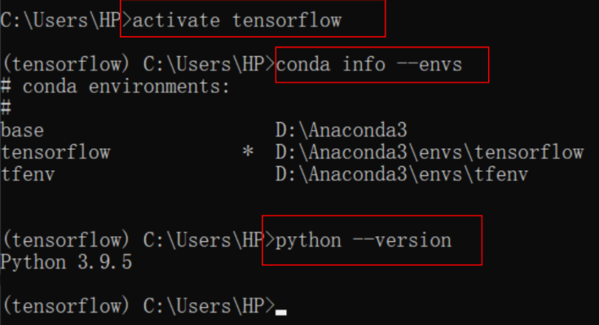
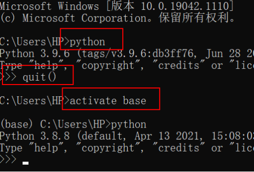
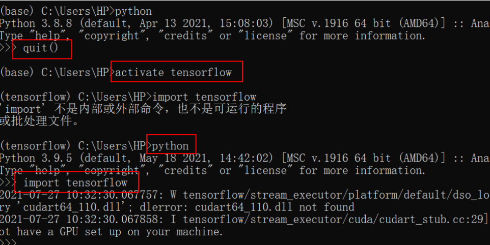
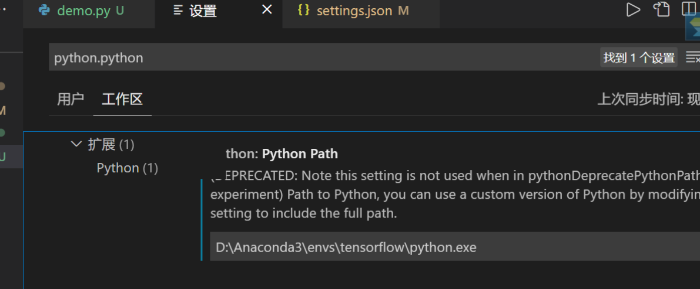

**keras的运行依赖于后端，安装TensorFlow作为keras的backend**

## **1、下载+安装anaconda**

[https://mirrors.tuna.tsinghua.edu.cn/anaconda/archive/?C=M&amp;O=D](https://mirrors.tuna.tsinghua.edu.cn/anaconda/archive/?C=M&O=D)

选windows-x86_64，All users，可以创建到别的盘，之后的取消打勾

配置Anaconda环境变量—高级系统设置

> E:\Anaconda（Python需要）
> E:\Anaconda\Scripts（conda自带脚本）
> E:\Anaconda\Library\mingw-w64\bin（使用C with python的时候） E:\Anaconda\Library\usr\bin
> E:\Anaconda\Library\bin（jupyter notebook动态库）

检验：cmd中输入 conda --version，conda info

打开****Anaconda Navifator 看能否进入界面**（需要关闭梯子）**

## **2.安装 tensorflow**

在cmd中输入：conda create --name tensorflow python=3.9

然后activate tensorflow

<center>

</center>

然后正式安装包（多安装几次

pip install --upgrade --ignore-installed tensorflow
显示Tensorflow（1.14.0版本）是68.3MB大小，默默等待进度条……

测试例子：

```
tf.compat.v1.disable_eager_execution()
import tensorflow as tf
hello = tf.constant('hello,tf')
sess = tf.compat.v1.Session()
print(sess.run(hello))
```

安装成功后，每次使用TensorFlow的时候都需要**激活conda环境**

```
查看环境：conda info --envs
激活环境：conda activate tensorflow(名字)
关闭环境：conda deactivate
```

再次测试：

<center>

</center>

### **出现的问题：**

<center>

</center>

**错误原因：找不到cudart64_110.dll**

**解决方法：下载**[https://www.dll-files.com/download/c25912d53d053412fd58bb7bf0a25c1e/cudart64_110.dll.html?c=bk41K1VjWElvTHhjT2lvc2g4dDBuQT09](https://www.dll-files.com/download/c25912d53d053412fd58bb7bf0a25c1e/cudart64_110.dll.html?c=bk41K1VjWElvTHhjT2lvc2g4dDBuQT09) 放入C:\Windows\System32

## **3.将tensorflow嵌入到IDE中**

安装python插件

添加tensorflow路径

通过Anaconda安装tensorflow时，一般会新建一个虚拟环境(env)，但是vscode在调试python代码时默认使用的是base环境下的路径。需要将tensorflow环境的路径添加到vscode的settings.json用户设置中，即可在vscode中搭建TensorFlow的开发环境。

<center>

</center>

出现的问题：vscode调试python时提示无法将“conda”项识别为cmdlet、函数....

解决方法：添加环境变量（两个都要

## **4.下载keras**

激活虚拟环境 conda activate tensorflow

然后 pip install keras

输入python 再输入import keras

注意：必须再虚拟环境中安装！
